# Intelligent placer

One of my student projects

The goal is to develop a software that uses computer vision techniques to determine whether a set of objects on a photo can be placed inside a given polygon.

The dataset for this task is available [here](https://drive.google.com/drive/folders/1S8v9H-KkYi79BR8xtAnso5NMvi3FW8qq?usp=sharing)

## Описание входных данных

На вход поступает изображение со светлым фоном
В в верхней части изображения на белом листке бумаги темным маркером нарисован многоугольник
В нижней части изображения находятся предметы. Один предмет присутствует на изображении не более одного раза.

Разрешение изображения 1280x800 +- 100 по каждой из осей
Высота съемки 20-30 см от поверхности
Угол наклона камеры не более 10 градусов по каждой из осей

Объектов должно быть не более 3-х на одном изображении
Объекты должны располагаться не менее чем в 2 см от границы избражения, листка бумаги
Объекты не должны перекрываться
Объекты должны располагаться ниже листка бумаги

Многоугольник должен быть выпуклым
Толщина линий, из которых состоит многоугольник, не менее 2-х и не более 7-ми пикселей.

## Описание выходных данных
Выход - схематичное изображение наилучшего расположения объектов внутри многоугольника. Пример:
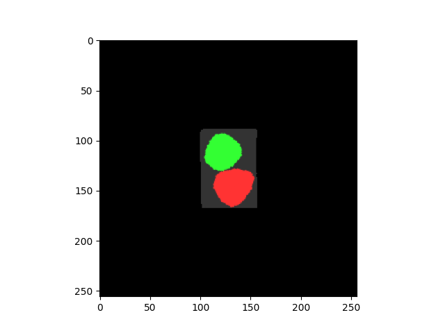

## Описание алгоритма
Решение задачи состоит из двух частей:
1. Сегментация предметов и многоугольника
2. Расположение полученных масок объектов внутри маски многоугольника

### Сегментация
Были сделаны фотографии каждого из предметов по отдельности и фотография поверхности.
Для каждого из предметов была вручную размечена маска.
Далее из полученных масок был создан синтетический датасет. Примеры изображений:
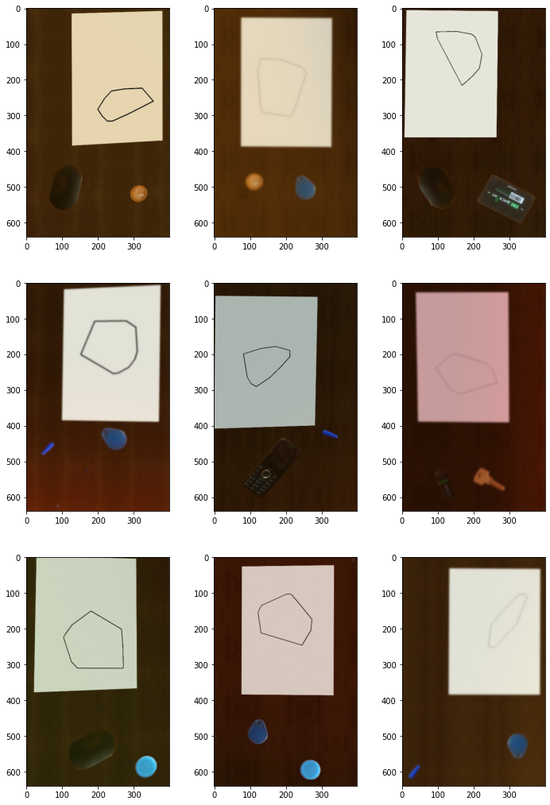

На этом датасете была обучена [MaskRCNN](https://arxiv.org/abs/1703.06870). Примеры результатов работы MaskRCNN:
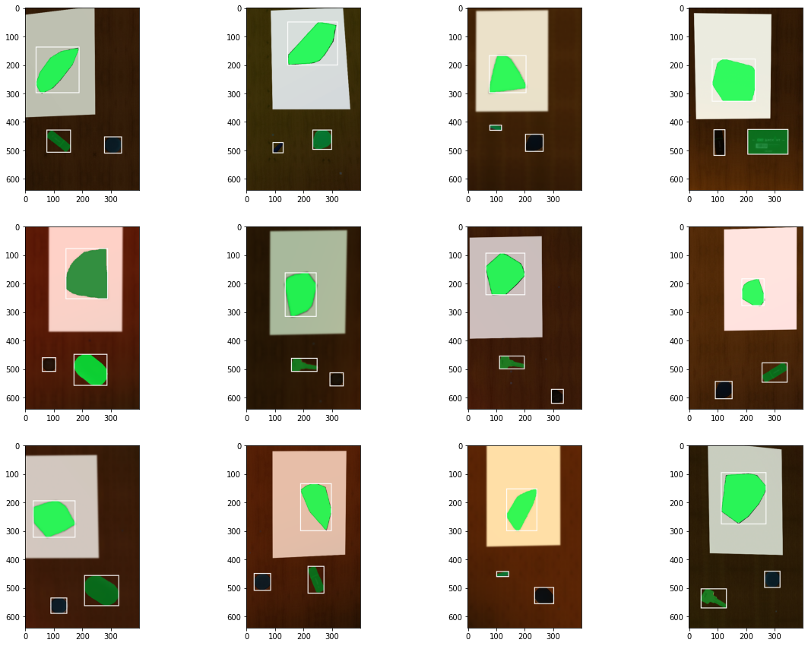

### Размещение предметов
Из масок, использованных для создания датасета для сегментации был также создан датасет, 
каждый элемент которого состоял из трех масок предметов и одной большой, обязательно вмещающей три маски предметов.
Примеры элементов датасета:
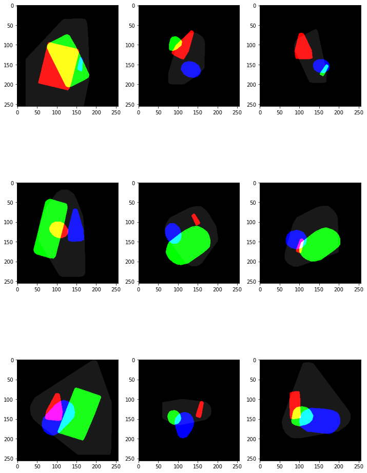

На этом датасете был обучен [Spatial Transformer](https://paperswithcode.com/paper/spatial-transformer-networks). 
Сеть получает на вход четыре канала. В первых трех находятся маски обектов, в последнем - маска многоугольника, 
применяет некоторое (вычисляемое по входу) ортогональное преобразование к трем первым каналам и выдает его результат.

Лосс функция:
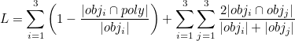

## Результаты
Далее приведены результаты работы на реальных изображениях.
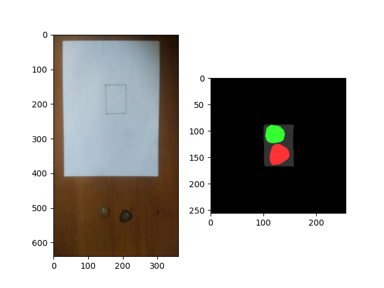
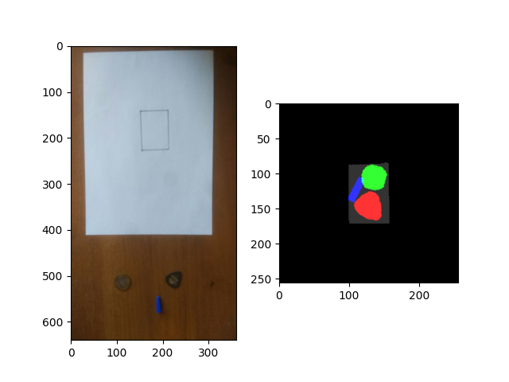
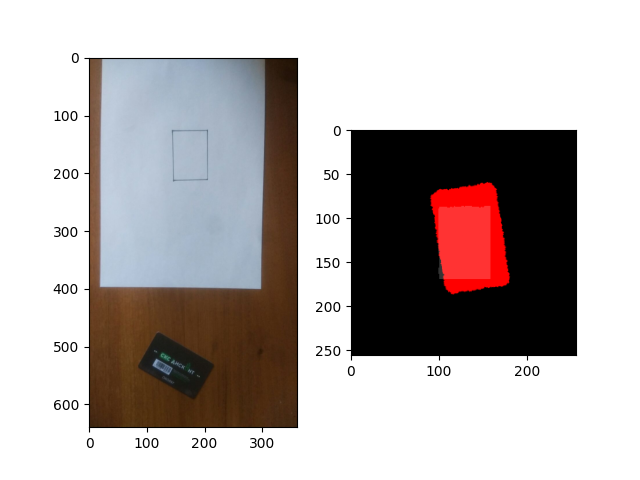
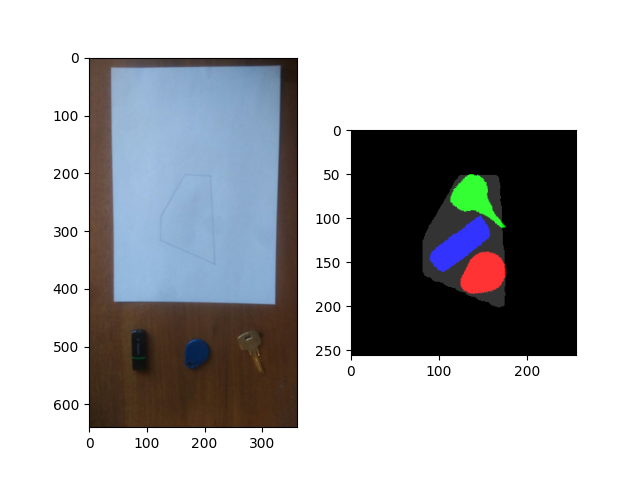
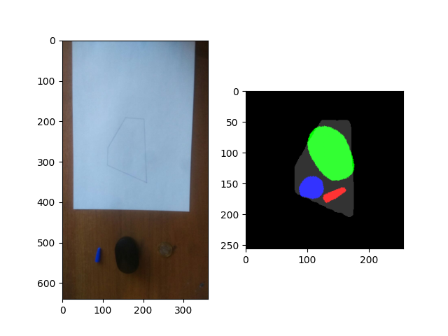
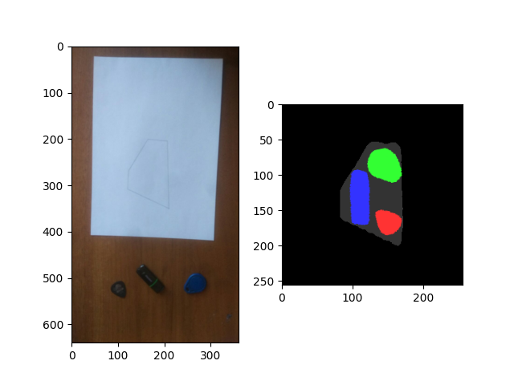
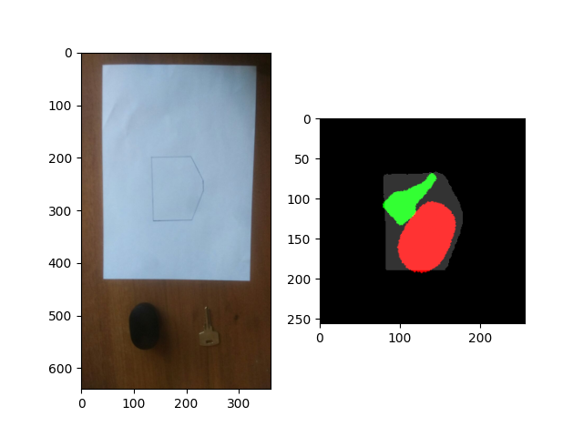
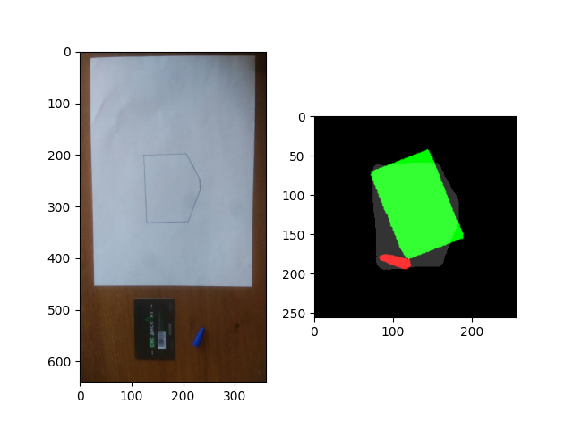

## Возможные улучшения
Можно улучшать качество синтезируемых датасетов. 
Невооруженным глазом видно, что в датасете для spatial transformer'а много "плохих" элементов с масками, вылезающими за края изображения.